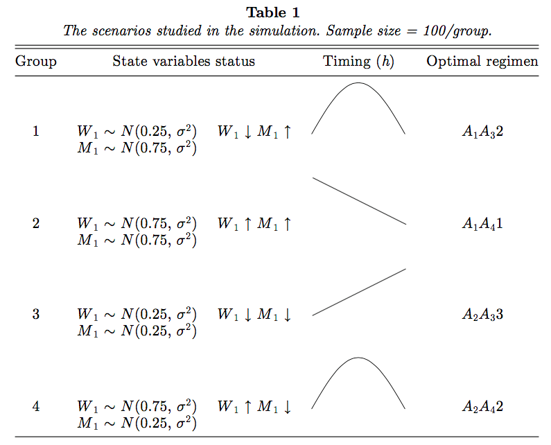

$t_{1}$ - decision time for the first line of treatment  
$t_{2}$ - decision time for second line of treatment

First, according to various $(W_{1}, M_{1})$ as described in Table 1, a noncensored sample of $N = 100$ virtual patients for each of the four disease profile groups (with total sample size $n = 400$) is generated.



```{r}
set.seed(20170220)
N = 100
sigma = 0.25 # no value given?
w <- c(0.25, 0.75, 0.25, 0.75)
m <- c(0.75, 0.75, 0.25, 0.25)
tibble(
  grp = rep(1:4, each = N),
  W = map(w, ~ rnorm(N, mean = ., sd = sigma)) %>% flatten_dbl(),
  M = map(m, ~ rnorm(N, mean = ., sd = sigma)) %>% flatten_dbl()
)
```

For the sake of simplicity, in these density functions only two state variables, quality of life (QOL) $W_t$ and tumor size $M_t$, are considered as patient prognostic factors or biomarkers to be related to outcome. We consider these two factors because they are patient based, realistically easy to measure, can predict therapeutic benefit after treatment of chemotherapy, and, more importantly, they are significant prognostic factors for survival (Socinski et al., 2007). In addition, state variables for the next decision are generated by the simple dynamic models $W_2 = W_1 + T_{M}\dot{W}_{1}$ and $M_2 = M_1 + T_{M}\dot{M}_{1}$, where $\dot{W}_{1}$ and $\dot{M}_{1}$ are constants.


The parameter vector for those receiving only first-line treatment is $\bf{θ}$$_{1} = (\alpha_{D_{1}}, \beta_{D_1}, \kappa_{D_1}, \tau_{D_1})$, otherwise it is $\bf{θ}$$_{2} = (\alpha_{D_{1}}^{P}, \beta_{D_1}^{P}, \kappa_{D_1}^{P}, \tau_{D_1}^{P}, \alpha_{D_{12}}, \beta_{D_12}, \kappa_{D_12}, \tau_{D_12},$ $\bf{\psi})$. Note that two patients receiving different second-line treatments, say $(A_1, A_3)$ and $(A_1, A_4)$, both contribute data for estimating $Q_1$.

```{r}

```


Based on historical research, it is well known that the rate of disease progression or death for patients with advanced NSCLC is nondecreasing over time. Consequently, to generate simulated data, we simply consider that $T_{1}$, $T_{P} − t_{2}$, and $T_{2}$ conditional on $T_D \geq t_2$ follow different exponential distributions. Many alternative models are also possible.

Let $\exp(x)$ denote an exponential distribution with mean $e^{x}$. Also let $W_t$ and $M_t$ be patient prognostic factors observable at $t = 1, 2$ (corresponding to times $t_1$ and $t_2$) to be defined shortly. For a patient given first-line treatment $d_1$, we assume that $T_1 = \tilde{T}_{1} \wedge t_2$, where

$$
  [\tilde{T}_{1} \mid D_{1}, W_{1}, M_{1}] \sim
    \exp(
    \alpha_{D_{1}} + \beta_{D_{1}} W_{1} + \kappa_{D_{1}} M_{1} +
      \tau_{D_{1}} W_{1} M_{1}
    ) \quad(3)
$$

If $\tilde{T}_{1} \geq t_{2}$, we generate $T_{M}$ from a uniform [0, 2] distribution. We now absorb $T_{P}$ into $T_{M}$ for modeling $T_{2}$ given $T_{D} \geq t_{2}$ through an intent-to-treat structure (basically, we can ignore $T_{P}$ because it depends only on $D_1$, $M_1$, and $W_1$ and not on $T_M$). In addition, for a patient given second-line treatment $d_2$ and initiation time $T_M$, we assume

$$
  [\tilde{T}_{2} \mid D_{1}, D_{2}, W_{2}, M_{2}] \sim
    \exp(
      \alpha_{D_{12}} + \beta_{D_{12}} W_{2} + \kappa_{D_{12}} M_{2} +
      h(T_{M}; \psi)
    ) \quad (4)
$$

where $h(T_{M}; \psi)$ is a function depending on the parameter $\psi$, which reflects the effect of timing $T_{M}$ on death. The shape of this time-related function may vary among different patients because of its dependence on patient characteristics. 

The total time to death is then $T_{D} = T_{1} + I(T_{1} = t_{2})T_{2}$. 

The maximum follow-up time $\tau$ is set to 25 (months). 

We then need to generate the right censoring time $C$ uniformly from the interval $[t_{1}, t_{1} + u]$. To find $u$, we estimate the unconditional survival function $\hat{S}(t)$ for the failure time $T_{D}$, where “uncon- ditional” refers to taking expectation over the covariates $D_{i}, W_{i}, M_{i}, (i = 1, 2)$, and $T_{M}$ of the conditional survival function $T_{D}$. Then, $u$ is the solution to $u−1 \int_{t_{1}}^{t_{1} + u} \hat{S}(x)\text{d}x = p$, where $p$ is the desired probability of censoring.


Note that in our simulation study we straightforwardly use exponential pdfs (3) and (4) to replace $f_{1}$ and $f_{3}$ and we drop $f_{2}$, where $(f_1, f_2, f_{3})$ were described in Section 2.1. 


```{r}
library(tidyverse)
N = 100
t2 = 2.8

a1 = 1
b1 = 1
k1 = 1
M1 = runif(N, 0, 2)
tau1 = 1
W1 = runif(N, 0, 2)

Ttilde1 = rexp(n = N, rate = exp(a1 + b1 * W1 + k1 * M1 + tau1 * W1 * M1)^(-1))

TM <- runif(N, 0, 2)
TM <- ifelse(Ttilde1 >= t2, TM, NA)
```

